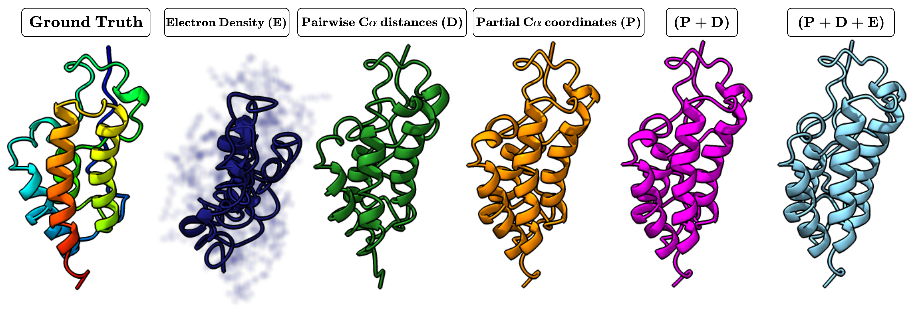

# Adam-PnP: Adaptive Multimodal Protein Plug-and-Play

This repository contains the official PyTorch implementation for the paper: **"ADAPTIVE MULTIMODAL PROTEIN PLUG-AND-PLAY WITH DIFFUSION-BASED PRIORS"**.

**Authors:** Amartya Banerjee, Xingyu Xu, Caroline Moosmüller, Harlin Lee

## Description

In an inverse problem, the goal is to recover an unknown parameter (e.g., an image) that has typically undergone some lossy or noisy transformation during measurement. Recently, deep generative models, particularly diffusion models, have emerged as powerful priors for protein structure generation. However, integrating noisy experimental data from multiple sources to guide these models remains a significant challenge. Existing methods often require precise knowledge of experimental noise levels and manually tuned weights for each data modality. In this work, we introduce Adam-PnP, a Plug-and-Play framework that guides a pre-trained protein diffusion model using gradients from multiple, heterogeneous experimental sources. Our framework features an adaptive noise estimation scheme and a dynamic modality weighting mechanism integrated into the diffusion process, which reduce the need for manual hyperparameter tuning.  Experiments on complex reconstruction tasks demonstrate significantly improved accuracy using Adam-PnP.




| Ground Truth | All Modalities (P + D + E) |
| :---: | :---: |
|   |  |


## Repository Structure

```
adam_pnp/
├── assets/
├── configs/
│   └── base_config.json      # Base configuration for experiments
├── data/
│   ├── cifs/                 # Protein structure files (.cif, .pdb)
│   └── mrcs/                 # Cryo-EM density maps (.mrc)
├── results/
│   └── (Output folder)       # Stores PDBs, plots, and metrics
├── adam_pnp/
│   └── src/                  # Source code for the framework
│       ├── measurements.py   # Modality-specific forward models
│       ├── noise.py          # Adaptive noise scheduling
│       ├── reconstruction.py # Main reconstruction algorithm
│       └── utils.py          # Helper functions and plotting
├── run_reconstruction.py     # Main script to run experiments
├── environment.yml           # Conda environment file for installation
└── README.md
```

## Setup and Installation

1.  **Clone the repository:**
    ```bash
    git clone [https://github.com/amartya21/Adam-PnP.git](https://github.com/amartya21/Adam-PnP.git)
    cd Adam-PnP
    ```

2.  **Create and Activate Conda Environment**
    This single command creates the environment from the `environment.yml` file and installs all necessary conda and pip packages.
    ```bash
    conda env create -f environment.yml
    conda activate adampnp-env
    ```
    You may also need to install `ffmpeg` for creating animations.
    ```bash
    conda install -c conda-forge ffmpeg
    ```


## Chroma API Key

To use the pre-trained Chroma model, you need an API key.

1.  **Request an API Key:** Follow [this link](https://chroma-weights.generatebiomedicines.com/) to request your key.
2.  **Register the Key:** Run the following command with the key you receive.
    ```bash
    python register.py --key YOUR_API_KEY
    ```


## How to Run

1.  **Place your data:**
    * Put your protein structure file (e.g., `7r5b.cif`) in the `data/cifs/` folder.
    * If using cryo-EM data, place the corresponding `.mrc` file in the `data/mrcs/` folder.

2.  **Configure your experiment:**
    * Modify the `configs/base_config.json` file to set up your experiment. You can enable different modalities, set noise levels, and change algorithm parameters.
    * Make sure the paths to your data files in the config are correct.

3.  **Run the reconstruction:**
    You can run an experiment using command-line arguments, which will override the `base_config.json`.

    **Example:** Run a reconstruction using 2000 observed pairwise distance and 63 partial coordinates for protein 7r5b.
    ```bash
    python run_reconstruction.py \
        --protein_path data/cifs/7r5b.cif \
        --partial \
        --distances \
        --n_partial 63 \
        --n_distances 2000 \
        --exp_name "recons_7r5b"
    ```

    **Example with custom config:** Use a custom configuration file with all three modalities.
    ```bash
    python run_reconstruction.py \
        --config configs/custom_params.json \
        --protein_path data/cifs/7r5b.cif \
        --partial \
        --distances \
        --density \
        --n_partial 63 \
        --n_distances 2000 \
        --exp_name "custom_recons_7r5b"
    ```

    All results, including the reconstructed `.pdb` file, a metrics plot, and log files, will be saved in the `results/recons_7r5b/` directory.


## Citation

Coming Soon

## License

This project is licensed under the MIT License - see the [LICENSE](LICENSE) file for details.